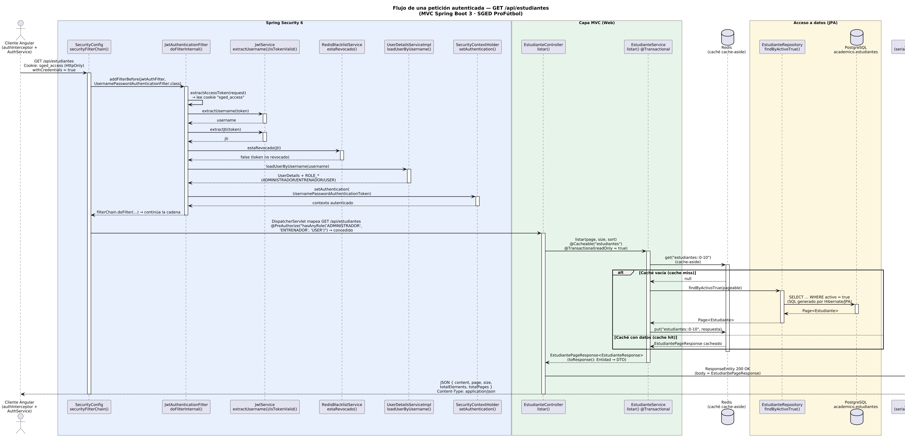

# SGED — Sistema de Gestión para la Escuela Deportiva ProFútbol

> **Repositorio de la Práctica Experimental — Unidad IV**
> Aplicaciones Web (111) · 5.° nivel · PPA 2026-2027 · Universidad Técnica Estatal de Quevedo
>
> Aquí se desarrolla la práctica de la Unidad IV sobre el Proyecto Fin de Curso
> (PFC): aplicación MVC completa con los módulos de la Entrega 1B funcionando,
> API REST documentada con Swagger, consumo de API externa con caché Redis,
> seguridad OWASP, pruebas de carga y el informe técnico final.
>
> Este repositorio es un clon derivado de `DarwinSM21/SGED_APPWEB` (historial
> completo de las entregas 1A–3 conservado); el trabajo de esta práctica se
> registra en las ramas `feature/u4-*`.

[](https://github.com/Richiflo0o/SGED_APPWEB_PE_U4/actions)
[](https://doi.org/10.5281/zenodo.21713240)
[](LICENSE)

Aplicación web para la gestión administrativa y deportiva de la escuela
ProFútbol: estudiantes, entrenadores, asistencias, evaluaciones y reportes.

**Versión de esta entrega:** `v1.0.0-rc` (Práctica Experimental Unidad IV, construida sobre `v0.9.0-rc` de la Tercera Entrega)

## Pila tecnológica

* Backend: Spring Boot 3.2.x (Java 21 LTS), Spring Data JPA, Spring Security (JWT en cookie HttpOnly), Flyway, Redis
* Frontend: Angular 17+
* Base de datos: PostgreSQL 16 (estrategia híbrida ORM + funciones/procedimientos almacenados)
* Orquestación: Docker Compose (imágenes pinadas por digest sha256)

## Flujo de una petición autenticada (MVC Spring Boot)

Diagrama de secuencia del ciclo de vida de una petición autenticada
(`GET /api/estudiantes`) con las clases y métodos reales del proyecto:



1. **Cliente Angular** (`authInterceptor`) envía `GET /api/estudiantes` con `withCredentials: true`; el navegador adjunta la cookie HttpOnly `sged_access`.
2. `SecurityConfig.securityFilterChain()` registra `JwtAuthenticationFilter` antes de `UsernamePasswordAuthenticationFilter`.
3. `JwtAuthenticationFilter.doFilterInternal()` extrae el token de la cookie con `extractAccessToken()`.
4. `JwtService` valida la firma/expiración (`isTokenValid`) y extrae `username` y `jti`.
5. `RedisBlacklistService.estaRevocado(jti)` verifica que el token no esté en la blacklist de Redis.
6. `UserDetailsServiceImpl.loadUserByUsername()` carga el usuario con sus roles (`ROLE_*`).
7. Se establece el `UsernamePasswordAuthenticationToken` en el `SecurityContextHolder`.
8. La autorización por rol evalúa `@PreAuthorize("hasAnyRole(...)")` y el `DispatcherServlet` mapea la ruta a `EstudianteController.listar()`.
9. `EstudianteService.listar(Pageable)` corre bajo `@Transactional(readOnly = true)` y consulta primero la caché Redis (`@Cacheable`).
10. `EstudianteRepository.findByActivoTrue(Pageable)` (Spring Data JPA/Hibernate) consulta PostgreSQL.
11. El service mapea la entidad a DTOs (`EstudianteResponse` / `EstudiantePageResponse`).
12. Jackson serializa la respuesta a JSON y se devuelve `HTTP 200 application/json` al cliente.

Fuente versionable: [`docs/diagramas/flujo-mvc-springboot.puml`](docs/diagramas/flujo-mvc-springboot.puml).

## Arranque en un solo comando (Bloque B.1)

Requisitos: Docker + Docker Compose + GNU Make.

```bash
git clone https://github.com/Richiflo0o/SGED_APPWEB_PE_U4.git
cd SGED_APPWEB_PE_U4
git checkout main
cp .env.example .env
make up
```

En menos de dos minutos:

| Servicio | URL |
|---|---|
| Frontend (HTTPS, recomendado) | https://localhost:8443 |
| Frontend (HTTP, sin cookie de sesion) | http://localhost:4200 |
| API REST | http://localhost:8080/api |
| OpenAPI 3.0 (JSON) | http://localhost:8080/api/api-docs |
| Swagger UI | http://localhost:8080/api/docs |

El certificado TLS de `https://localhost:8443` es autofirmado (generado en
build, solo para desarrollo/evaluacion) — el navegador va a mostrar una
advertencia de certificado no confiable, es esperado.

**Credenciales semilla** (definidas en `db/seed.sql`):

```
usuario:    admin
contraseña: Admin2026!
```

## Objetivos Make

| Comando | Acción |
|---|---|
| `make up` | Levanta el sistema completo desde clonación limpia |
| `make down` | Apaga los contenedores |
| `make test` | Pruebas JUnit 5 + reporte de cobertura JaCoCo |
| `make bench` | 3 corridas k6 (50 VUs, 30 s) + análisis con IC 95 % |
| `make audit` | Auditoría OWASP (6 controles) + auditoría de SQL dinámico |
| `make clean` | Limpia contenedores, volúmenes y builds |

## Estructura del repositorio

Sigue la estructura obligatoria de la guía de la Tercera Entrega:
`db/` (schema, seed, procs), `docs/` (requisitos, observaciones, adr,
mediciones, trazabilidad, ética), `k6/`, `scripts/`, `.github/workflows/`.

## Evidencia y reproducibilidad

* **Informe de la Tercera Entrega (PDF):**
  [`docs/informe-entrega-3.pdf`](docs/informe-entrega-3.pdf) — 26 páginas,
  es la ruta que exige la guía.
* Fuente del informe: [`docs/informe/main.tex`](docs/informe/main.tex),
  compilable con `pdflatex→bibtex→pdflatex→pdflatex`. El PDF de arriba se
  genera de aquí: existe fuente versionada y es reproducible, a diferencia
  de un PDF suelto sin `.tex`/`.docx`, que no sería evidencia verificable
  (Bloque 0 / P4).
* Mediciones crudas: `docs/mediciones/` (perf, sec, sus, lighthouse, jacoco)
* Matriz de trazabilidad: `docs/trazabilidad/matriz.csv`
* Catálogo de procedimientos: `docs/basedatos/CATALOGO-SP.md`
* Video de demostración: PENDIENTE (enlace)
* DOI Zenodo: PENDIENTE
* Lighthouse SEO: 63 (intencional, ver REPORT.md §3 — privacidad de datos de menores)

## Integrantes

Equipo PFC (entregas 1A–3):
* ARCALLE GREFA DARWIN ORLANDO
* PALLO PINTO ALEJANDRO DANIEL
* VELEZ LOPEZ RICARDO ELIAS

Equipo Práctica Experimental Unidad IV:
* VELEZ LOPEZ RICARDO ELIAS
* Integrante A
* Integrante B

<!-- TODO(U4): reemplazar "Integrante A" e "Integrante B" por los nombres reales del grupo de la práctica -->

Roles CRediT: ver `CONTRIBUTORS.md`.

## Licencia

MIT — ver `LICENSE`.
